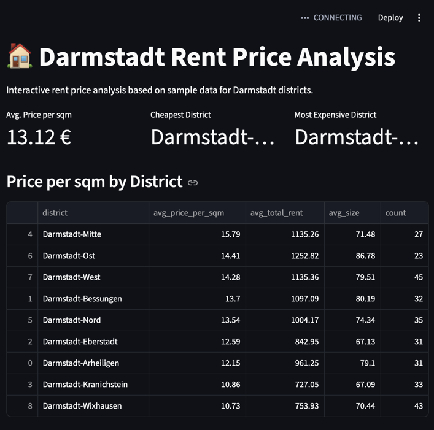
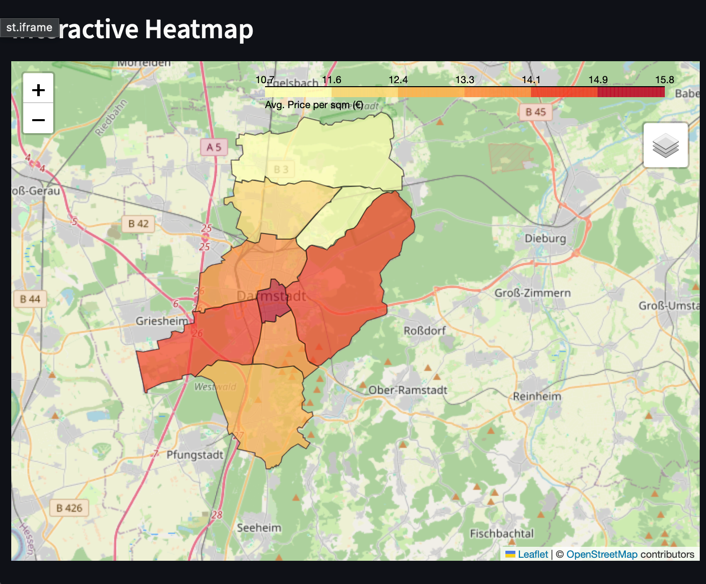

# Darmstadt Rent Price Analysis

Interactive rent price analysis and choropleth heatmap for Darmstadt districts.

## Features
- Generates realistic sample rent data for all 9 Darmstadt districts
- Cleans and validates data (removes outliers and missing values)
- Calculates key metrics per district (avg. price per sqm, total rent, size)
- Interactive choropleth heatmap using official Darmstadt GeoJSON data
- Streamlit dashboard with metrics, sortable table and heatmap

## Quickstart

    git clone https://github.com/Thenyen/darmstadt-rent-analysis.git
    cd darmstadt-rent-analysis
    pip install -r requirements.txt
    .venv/bin/python -m streamlit run app.py

Open `http://localhost:8501` in your browser.

## Project Structure

    darmstadt-rent-analysis/
    ├── data/
    │   ├── scraper.py            # Generates sample rent data
    │   ├── clean.py              # Data cleaning and district aggregation
    │   ├── map.py                # Folium choropleth heatmap
    │   ├── convert_geojson.py    # Converts GeoJSON from EPSG:25832 to WGS84
    │   ├── stadtteile.geojson    # Official Darmstadt district boundaries
    │   └── stadtteile_wgs84.geojson  # Converted GeoJSON for Folium
    ├── app.py                    # Streamlit dashboard
    ├── main.py                   # CLI output and map export
    └── requirements.txt

## Data Sources
- District boundaries: [Wissenschaftsstadt Darmstadt Open Data](https://opendata.darmstadt.de/dataset/statistische-stadtteile-darmstadt) (License: dl-zero-de/2.0)
- Rent prices: Synthetic sample data based on realistic Darmstadt price levels

## Roadmap
- [ ] Real rent data via web scraping
- [ ] Bar chart comparing districts
- [ ] Filter by apartment size
- [ ] Export data as CSV